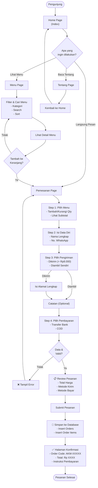
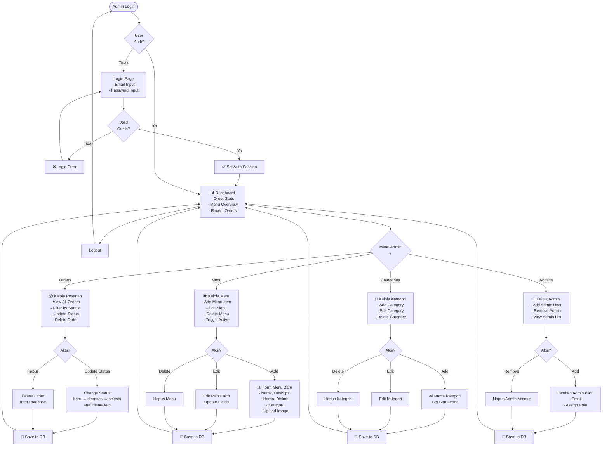
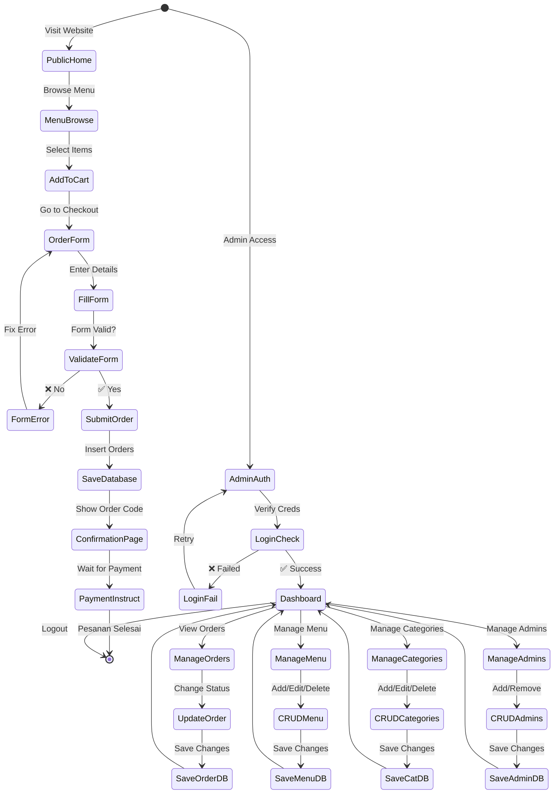
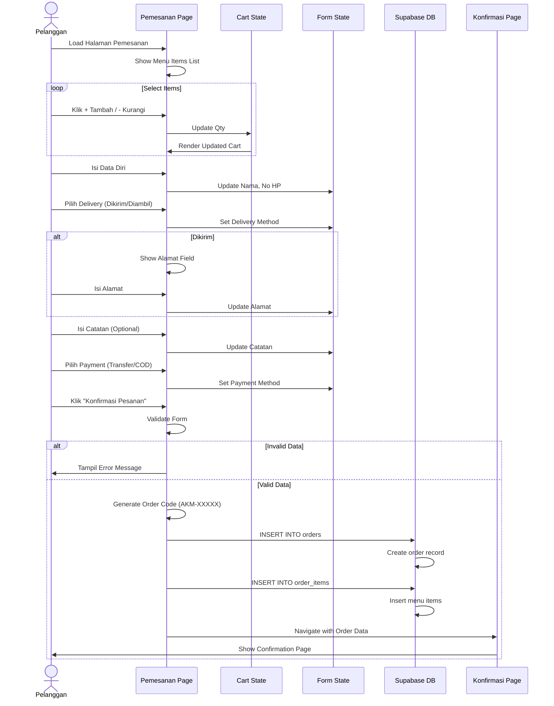
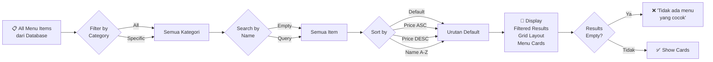
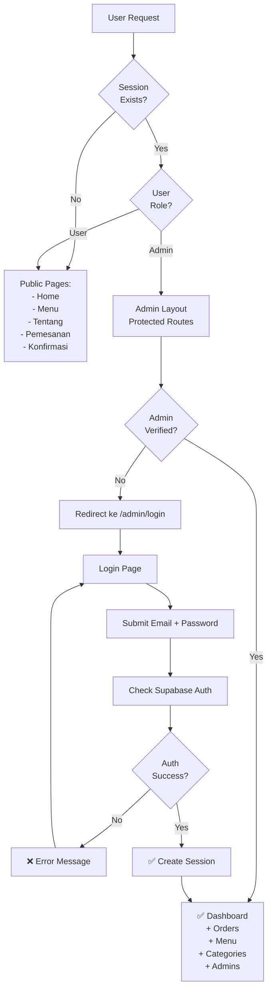
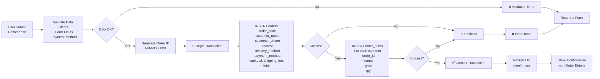
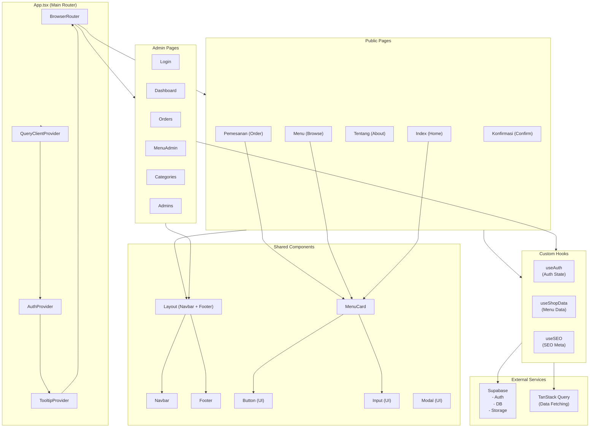

# Activity Diagram - Akumoo RPL

## User Flow Diagram (Pelanggan)

## Admin Flow Diagram (Admin Panel)

## Complete System Flow (User + Admin)

## Pemesanan Page Activity Flow (Detail)

## Menu Filtering & Searching Logic

## Authentication & Authorization Flow

## Database Transaction Flow (Order Creation)

## Component Interaction Diagram

